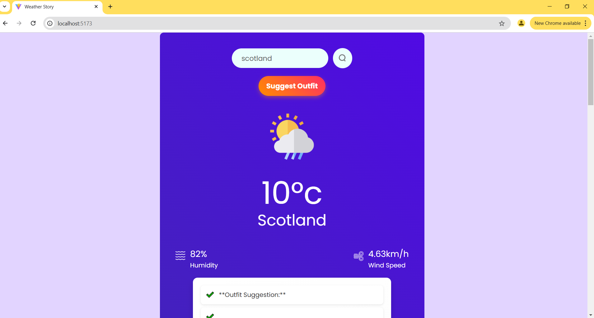

# MyWeatherStory

Stay updated with real-time weather conditions! This app leverages the Gemini AI model to suggest the perfect outfit and essential tips for the day

**Link to project:** http://https://myweatherstory.onrender.com/

## How It's Made:

**Tech used:** React, CSS, JavaScript, Gemini AI, OpenweatherAPI

My learning was focused on making a simple UI and a smooth UX, and taking advantage of the endless possibilities of AI models to solve real-time problem.

## Optimizations

When I improve this project, I would make the outfit suggestions in form of a card to give a more beautiful UI for an improved user experience
## Lessons Learned:

I learnt that creating a successful project, isn't determined by it's complexity.

## Examples:
Take a look at these couple examples that I have in my own portfolio:

**MARKETPLACE:** https://marketplace-dummy-frontend.vercel.app/

**Productivity APP:** https://locked-in.onrender.com/

**CONSTRUCTION WEBSITE:** https://masan-construction.vercel.app/

